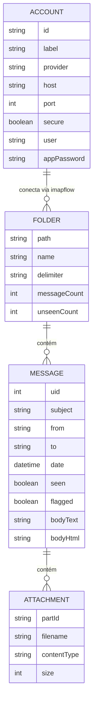

# Diagrama de Entidade-Relacionamento (DER) — mail-mcp-server

## Contexto

O `mail-mcp-server` não utiliza um banco de dados relacional tradicional. O
modelo abaixo representa o **fluxo lógico de dados** do sistema:

- **Account (Conta)** é a única entidade verdadeiramente persistida — carregada
  a partir do arquivo de configuração local `config/accounts.json`. Ela funciona
  como a "raiz" do modelo e é exposta pela ferramenta `mail_list_accounts`.
- **Folder (Pasta)**, **Message (Mensagem)** e **Attachment (Anexo)** são
  entidades **remotas e efêmeras**: não existem em um banco local, mas são
  obtidas em tempo real do servidor IMAP a cada chamada de ferramenta, através
  de um **pool de conexão IMAP simples** construído sobre a biblioteca
  `imapflow`. O conteúdo das mensagens (corpo texto/HTML e metadados) é
  processado sob demanda pela biblioteca `mailparser`.

Ou seja, o diagrama descreve a *forma lógica* dos dados que trafegam entre a
configuração local e o servidor IMAP remoto, e não um schema de banco de dados
persistente.

## Diagrama (Mermaid)

## Entidades e ferramentas MCP associadas

| Entidade   | Origem              | Ferramenta MCP             | Natureza                          |
|------------|----------------------|-----------------------------|-----------------------------------|
| Account    | `config/accounts.json` | `mail_list_accounts`        | Local, persistente                |
| Folder     | Servidor IMAP        | `mail_list_folders`         | Remota, obtida via `imapflow`     |
| Message    | Servidor IMAP        | `mail_search_messages` / `mail_get_message` | Remota, parseada via `mailparser` |
| Attachment | Servidor IMAP        | `mail_get_attachment`       | Remota, metadados extraídos na leitura da mensagem |

## Cardinalidade

- **1 Account → N Folder**: uma conta configurada localmente abre uma conexão
  IMAP (via `imapflow`) que enxerga múltiplas pastas/mailboxes remotas.
- **1 Folder → N Message**: cada pasta contém múltiplas mensagens, buscadas
  com filtros (remetente, assunto, data, status de leitura) por
  `mail_search_messages` e lidas individualmente por UID via
  `mail_get_message`.
- **1 Message → N Attachment**: uma mensagem pode ter zero ou mais anexos,
  cujos metadados são identificados pelo `mailparser` no momento da leitura e
  cujo conteúdo binário é obtido sob demanda por `mail_get_attachment`.

Como Folder, Message e Attachment não são armazenados localmente, não há
chaves estrangeiras persistidas: o relacionamento é reconstruído a cada
requisição através da hierarquia natural do protocolo IMAP (conta → pasta →
UID da mensagem → índice/partId do anexo).
